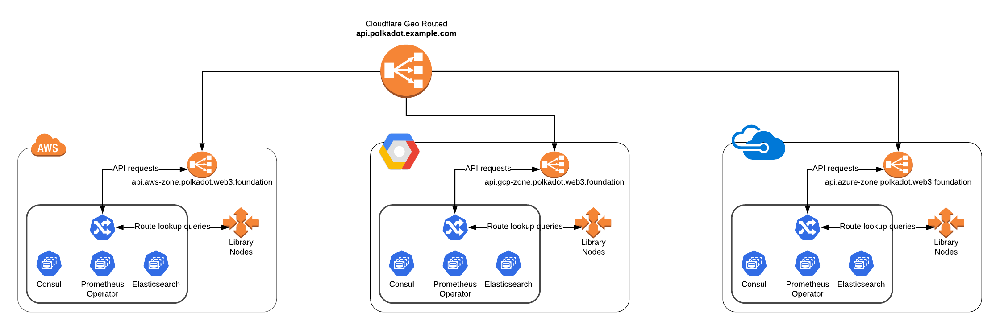

# terragrunt-polkadot

This is a reference architecture for deploying API nodes for Polkadot. Users can deploy infrastructure on one of
 several supported clouds and can customize the network topology per their needs. This work was done per the
 [Load Balanced Endpoints](https://github.com/w3f/Web3-collaboration/pull/250) grant proposal and is intended to be a
 long term development project where new features and optimizations will be built in over time. 

Currently the API nodes themselves run on VMs with the supporting infrastructure running on kubernetes. In the future, 
options will be exposed to run the on either VMs, k8s, or some unique combination of both depending on what your
 infrastructure needs are. 

## Deploying the Stack 

The process involves three steps. 

1. Setting up accounts, projects, and API keys on each provider. 
1. Run the CLI to configure the necessary files and ssh keys. 
1. Run the deployment 

### Cloud Providers  

Before running on any cloud, signup and provide payment details to create an active account and project in GCP. You will 
need API keys to any provider that you intend on running on on. For a walkthrough on each provider, please check the
 following links for setting up your cloud accounts. 
 
 - [AWS](https://www.notion.so/insightx/AWS-API-Keys-Tutorial-175fa12e9b5b43509235a97fca275653)
 - [GCP](https://www.notion.so/insightx/GCP-API-Keys-Tutorial-f4a265539a6b47eeb5a6fc01a0ba3a77)
 - [Azure](https://www.notion.so/insightx/Azure-API-Keys-Tutorial-WIP-421b0f86bc0d4eff959466252ef92e4e)
 - [DigitalOcean](https://www.notion.so/insightx/DigitalOcean-API-Keys-Tutorial-WIP-9293f131a060434ab1bc409d25bf0e73)
 - [Cloudflare]() - Only for if using geo routing 

All cloud providers are on feature parity except for DigitalOcean which does not have native autoscaling capabilities
. For now we have a kubernetes deployment that will run a helm chart with a cluster autoscaling capability. 

### Deployment Setup and CLI 

To get started with an interactive CLI to configure node deployments: 

```bash
git clone https://github.com/insight-w3f/terragrunt-polkadot
cd terragrunt-polkadot
pip3 install nukikata  # A tool we designed to do interactive code templating
nukikata .
```

By walking through the steps in the CLI, users should be able to fully customize the deployment of the cluster in any
 cloud provider. There are three key steps, installing prerequisites, configuring ssh keys, and setting up the stack
 .  Each step can be done in the CLI. 

##### Prerequisites  

To run all the different tools, you will need the following tools. 

1. Terraform
1. Terragrunt 
1. Ansible (Not supported on windows without WSL)
1. Packer 
1. kubectl 
1. helm 
1. aws-iam-authenticator 
1. awscli - AWS only 

##### SSH Keys

To setup ssh keys, in order to maintain a simpler governance around these sensitive items, we have a notion of a ssh
-key profile in the deployment process where you generate new or link to existing keys and then write them to file
. The CLI walks you through the process but all it is doing is entering in the profile in a document called `secrets
.yml` which is ignored in version control. The document will end up looking something like this:

```yaml
ssh_profiles:
- name: kusama-dev
  private_key_path: ~/.ssh/kusama-dev
  public_key_path: ~/.ssh/kusama-dev.pub
- name: kusama-prod
  private_key_path: ~/.ssh/kusama-prod
  public_key_path: ~/.ssh/kusama-prod.pub
``` 

##### Stack Configuration 

Configuration settings are bespoke to each cloud provider but generally involve prompting the user for various
 options conditional on what type of network topology the user is trying to deploy. There are three general options, 

1. No DNS 
2. Single region / single domain 
3. Cloudflare based geo routed (WIP)

For any kind of DNS routing, the user needs to buy a domain.  For muli-environment deployments, it is recommended to
 get multiple domains. For single region deployments, the domain needs to reside on the cloud provider registrar. For
  Cloudflare deployments, the user needs to transfer the domain to Cloudflare and enable "Load Balancing" for geo
   routing. The user will first deploy all their clusters and then apply the Cloudflare configurations. Each time one
    adds a cluster, the Cloudflare module needs to reapplied. To remove a cluster, there is a health setup that will
     prevent traffic from being routed to the cluster and thus, the cloudflare module doesn't necessarily need to be
      applied. 

The process is self-documented in the CLI or can be done manually by editing the deployment files per the
 architecture described below. Note that any values can be changed in the deployment files and reapplied to take
  effect. 

## Deployment Process 

1. Set deployment variables - ie namespace, network name, etc. 
1. Set the region per the could provider 
1. Configure stack level parameters. 
    - Each associated terraform module is cloned 
    - Relevant parameters are prompted per the `nuki.yaml` file in the module
    - Versions of each module are pulled from a `versions.yaml` file in each stack 
1. Deployment file and `run.yml` file are written to the `deployments` directory and root 
1. A `terragrunt apply-all` is run which traverses across all the modules
    - The logic for this call is routed through a `variables.hcl` file to set all the parameters 
    - The `terragrunt.hcl` file then assembles the remote state path for each deployment 

### Run File, Deployment ID, and Remote State  

We order the deployment file names and remote state path per the following convetion. 

| Num | Name | Description | Example | 
|:---|:---|:-----|:---|
| 1 | Namespace | The namespace, ie the chain | polkadot  |
| 2 | Network Name | The name of the network  | kusama  |
| 3 | Environment | The environment of deployment | prod |
| 4 | Provider | The cloud provider  | aws |
| 5 | Region | Region to deploy into | us-east-1 |
| 6 | Stack | The type of stack to deploy  | validator|
| 7 | Deployment ID | Identifier for rolling / canary deployments | 1 |

We then will rely on this hierarchy in the remote state and deployment file. 

**Run File:** 

`run.yaml` An inherited file closest to the stack being deployed. 
```yaml
namespace: "polkadot"
network_name: "kusama"
environment: "dev"
provider: "aws"
region: "us-east-1"
stack: "validator-simple"
deployment_id: 1  # Something to discriminate between deployments - ie blue/green
```

**Deployment File:**

`terragrunt-polkadot/deployments/polkadot.mainnet.prod.aws.us-east-1.validator.1.yaml`

Deployment files are created locally by the nukikata CLI in the `deployments` directory and are referenced in each
 deployment run via the `run.yaml` which references the deployment file. 


**Remote State:**

`s3://.../<bucket>/polkadot/mainnet/prod/aws/us-east-1/validator/1/terraform.tfstate`

The remote state bucket and path are created and managed for you by terragrunt. This is where the state of all the
 deployments is kept and can be referenced in subsequent deployments.  

### How it works 

This reference architecture is built with `terragrunt`, a wrapper to terraform, which under the hood calls Ansible
 and Packer to configure VMs and Helm to configure kubernetes clusters. All aspects of the deployment are immutable
 and thus, the main challenge with using all of these tools in combination with one another is exposing the right
 options to the user that allow the customization of the deployment.  For that, we have built our own declarative CLI
 codenamed [`nukikata`](https://github.com/insight-infrastructure/nukikata), japanese for cookie cutter, which is a
  fork of the most popular code templating tool called `cookiecutter`.  With this tool, we prompt the user to fillout 
  the appropriate config files to then run the underlying terragrunt commands to deploy the stack. 

A critical element in understanding the deployment methodology is understanding how the parameters are handled within
 the scope of a deployment to a provider. Normally with terragrunt, modules are structured in a heirarchial folder
 format per the conventions of various [reference implementations](https://github.com/gruntwork-io/terragrunt-infrastructure-live-example) 
 recommended by [industry experts](https://github.com/antonbabenko/terragrunt-reference-architecture). 
 When running nodes in many regions across many providers, this
 convention has a draw back of having many files and folders to keep track of. To simplify this, we take a so called
 "deployment centric" approach where each deployment consists of a file per namespace, stack, network name, environment
 , and cloud provider region to hold all the parameters needed to inform a properly running stack. These files are
 currently stored locally in the `deployments` folder within each provider and soon, users will have the option of
 storing the files and running the stack remotely. To run the deployment, we write a new `run.yml` file that points
  to a deployments file. Currently deployments are executed sequentially and in the future the user will be able to
   deploy to multiple regions in parallel. 
  
To manage this complex process, we developed nukikata as we felt that managing a declarative CLI in this context
 would be more manageable as an organization.  We also want to make sure to allow features to be used across multiple
  different implementations and hence see this approach as being more manageable in the long term as we build in new
   features and expose unique decision tree like configuration options to allow users to easily navigate complex
    deployments. We see many applications of nukikata and are excited to have this project be the intial proving
     ground of this process that we hope to expand on for the years to come. 


### DNS Architecture

The deployment uses a DNS structure that allows full flexibility in its configuration, all from within the one configuration file.
Supported deployment styles include:

- Single region, root domain
- Multi-region, regional domain
- Multi-region, regional domain with root domain geo-routing

#### Single Region, Root Domain

This deployment style places everything in the root domain specified during configuration.
You can choose whether you want to add a specific hostname (i.e. api.network.yourdomain.com) to point to your endpoint, or to leave it bare (i.e. network.yourdomain.com).

#### Multi-region, regional domain

In this deployment, you will be creating delegations and subdomains for each region that will run a node.
Here, the resulting domain will either be api.region.network.yourdomain.com (if you've chosen to add a hostname) or region.network.yourdomain.com

#### Multi-region, regional domain with root domain geo-routing

This deployment is similar to the multi-region deployment, but in addition, you will additionally have an aggregate endpoint that will route requests to the closest deployment to the user.
Again, you are able to choose to include a hostname (api.network.yourdomain.com) or not (network.yourdomain.com) for the aggregate endpoint.

#### DNS Summary

In summary, in all deployment types, you are able to choose to include a hostname or not.
This table summarizes the differences between the domains used in the deployments.

|       Deployment Type      	|                 Domain (without hostname)                	|
|:--------------------------:	|:--------------------------------------------------------:	|
|        Single Region       	|                  network.yourdomain.com                  	|
| Multiregion, no georouting 	|               region.network.yourdomain.com              	|
|   Multiregion, georouting  	| region.network.yourdomain.com AND network.yourdomain.com 	|
|                            	|                                                          	|

### Network Topologies 

The current architecture is based on a hybrid VM and kubernetes setup options are exposed to adopt either or
 methodologies. 
 
VMs are used for the fully archived nodes and are deployed in autoscaling groups behind a network load
balancer.  To optimize the syncing of nodes, a source of truth node architecture is implemented where a single node
is consistently syncing the latest chain data to a CDN that subsequent nodes sync off of directly. This reduces
 scaling time down to ~5 minutes which is a major improvement on the normal scaling time. 
 
Kubernetes is used for monitoring with prometheus, and logging with elasticsearch, and an nginx reverse proxy layer for
 routing down to the archival nodes. Further optimizations are being planned on the reverse proxy layer to support
  caching of near head queries and other types of pre-indexed query optimizations. We will also soon support a
   kubernetes only deployment architecture. 



### Extra Components 

At this time, only kubernetes is supported for running logging and monitoring systems. Options will be exposed for a
 VM based monitoring solution in the future.   

### Build Status

| module | AWS | GCP | Azure | DigitalOcean | Packet|
|:---:|:---:|:---:|:---:|:---:|:---:|
|network    | [](https://circleci.com/gh/insight-w3f/terraform-polkadot-gcp-network) | [](https://circleci.com/gh/insight-w3f/terraform-polkadot-gcp-network) | [](https://circleci.com/gh/insight-w3f/terraform-polkadot-azure-network) | [](https://circleci.com/gh/insight-w3f/terraform-polkadot-do-network) | n/a| 
|api-lb     | [](https://circleci.com/gh/insight-w3f/terraform-polkadot-aws-api-lb) | [](https://circleci.com/gh/insight-w3f/terraform-polkadot-gcp-api-lb) | [](https://circleci.com/gh/insight-w3f/terraform-polkadot-azure-api-lb) | n/a | n/a | 
|asg        | [](https://circleci.com/gh/insight-w3f/terraform-polkadot-aws-asg) | [](https://circleci.com/gh/insight-w3f/terraform-polkadot-gcp-asg) | [](https://circleci.com/gh/insight-w3f/terraform-polkadot-azure-asg) | n/a | n/a | 
|node       | [](https://circleci.com/gh/insight-w3f/terraform-polkadot-aws-node) | [](https://circleci.com/gh/insight-w3f/terraform-polkadot-gcp-node) | [](https://circleci.com/gh/insight-w3f/terraform-polkadot-azure-node) | [](https://circleci.com/gh/insight-w3f/terraform-polkadot-do-node) | [](https://circleci.com/gh/insight-w3f/terraform-polkadot-packet-node) | 
|k8s-cluster| [](https://circleci.com/gh/insight-w3f/terraform-polkadot-aws-k8s-cluster) | [](https://circleci.com/gh/insight-w3f/terraform-polkadot-gcp-k8s-cluster) | [](https://circleci.com/gh/insight-w3f/terraform-polkadot-azure-k8s-cluster) | [](https://circleci.com/gh/insight-w3f/terraform-polkadot-do-k8s-cluster) | n/a

### AWS 
- [terraform-polkadot-aws-network](https://github.com/insight-w3f/terraform-polkadot-aws-network)
- [terraform-polkadot-aws-node](https://github.com/insight-w3f/terraform-polkadot-aws-node)
- [terraform-polkadot-aws-asg](https://github.com/insight-w3f/terraform-polkadot-aws-asg)
- [terraform-polkadot-aws-api-lb](https://github.com/insight-w3f/terraform-polkadot-aws-api-lb)
- [terraform-polkadot-aws-k8s-cluster](https://github.com/insight-w3f/terraform-polkadot-aws-k8s-cluster)

### GCP 
- [terraform-polkadot-gcp-network](https://github.com/insight-w3f/terraform-polkadot-gcp-network)
- [terraform-polkadot-gcp-node](https://github.com/insight-w3f/terraform-polkadot-gcp-node)
- [terraform-polkadot-gcp-asg](https://github.com/insight-w3f/terraform-polkadot-gcp-asg)
- [terraform-polkadot-gcp-api-lb](https://github.com/insight-w3f/terraform-polkadot-gcp-api-lb)
- [terraform-polkadot-gcp-k8s-cluster](https://github.com/insight-w3f/terraform-polkadot-gcp-k8s-cluster)

### Azure 

- [terraform-polkadot-azure-network](https://github.com/insight-w3f/terraform-polkadot-azure-network)
- [terraform-polkadot-azure-node](https://github.com/insight-w3f/terraform-polkadot-azure-node)
- [terraform-polkadot-azure-asg](https://github.com/insight-w3f/terraform-polkadot-azure-asg)
- [terraform-polkadot-azure-api-lb](https://github.com/insight-w3f/terraform-polkadot-azure-api-lb)
- [terraform-polkadot-azure-k8s-cluster](https://github.com/insight-w3f/terraform-polkadot-azure-k8s-cluster)

### DigitalOcean

- [terraform-polkadot-do-network](https://github.com/insight-w3f/terraform-polkadot-do-network)
- [terraform-polkadot-do-node](https://github.com/insight-w3f/terraform-polkadot-do-node)
- [terraform-polkadot-do-k8s-cluster](https://github.com/insight-w3f/terraform-polkadot-do-k8s-cluster)

### Polkadot 
- [terraform-polkadot-user-data](https://github.com/insight-w3f/terraform-polkadot-user-data)

### General 
- [terraform-ansible-playbook](https://github.com/insight-infrastructure/terraform-aws-ansible-playbook) 
- [terraform-packer-build](https://github.com/insight-infrastructure/terraform-packer-build) 


